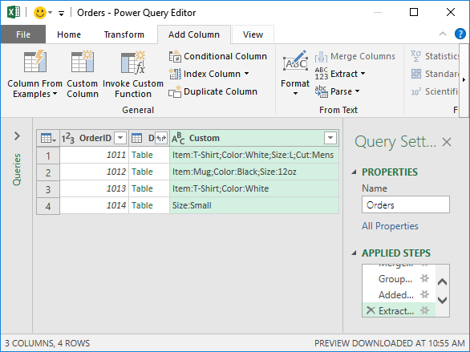

# Objective
Let’s say we’ve exported data from our accounting system. Rather than displaying one row for each record, our system uses many rows for each order. Plus, the orders have a variable number of rows. In other words, some orders have 4 rows while others have 3 and so on. This is illustrated below:


But, what we need is a single row per OrderID, with the Attribute and Value strings combined in a single delimited list. Basically, we want it to look like this:


As with anything in Excel, there are multiple ways to accomplish this task. Currently, I’m on a Power Query kick, so this post will demonstrate how to do it with Power Query.

Here are the steps:

- Create our basic query
- Do a few transformations
- Return the data to our worksheet
Let’s get to it.

_Note: The steps below are presented with Excel for Windows 2016. If you are using a different version of Excel, please note that the features presented may not be available or you may need to download and install the Power Query Add-in._

# Create our basic query
First, we need to get our data table from our worksheet into Power Query. So, we select any cell in the table and click Data > From Table/Range. And, just like that, we have our data loaded into the Power Query window, as shown below.


Now the fun begins 🙂

# Do a few transformations
In this case, we want to retain both the Attribute and Value text, so, we’ll combine them into a single column and use a colon : delimiter. We do this by selecting both the Attribute and Value columns at the same time (Ctrl + click) and then select Transform > Merge Columns. The Merge Columns dialog is displayed, we pick the colon Separator and set the new combined column name to Merged, as shown below.


We click OK, and the updated query is shown below.


Now, we need to create one row for each OrderID. We can do this by clicking the Transform > Group By command. The Group By dialog is displayed. We want to Group by the OrderID column and we want the new column to be named Data and to contain All Rows, as shown below.


We click OK and the updated query is shown below.


Now, this is the cool part. And this part I learned from Ken Puls and Miguel Escobar during their workshop, which, was totally awesome by the way 🙂 They taught a bunch of the content from their wonderful book called M is for (Data) Monkey, which, I highly recommend.

We need to create a new column, so, we select Add Column > Custom Column. The Custom Column dialog opens where we specify any column name and then write the following formula:

```
=Table.Column([Data],"Merged")
```

Where [Data] is the name of the table column, and “Merged” is the column name we set up previously.

_Note: if you used different names then you’ll want to update the formula accordingly._


Now, this creates a new list column, as shown below.


Now, from here, we click the Expand icon on the right side of the Custom header and select Extract Values as shown below.


This displays the **Extra values from list** dialog, where we specify our desired delimiter, in this case a Semicolon, as shown below.


We click OK … and Bam! (shown below)

